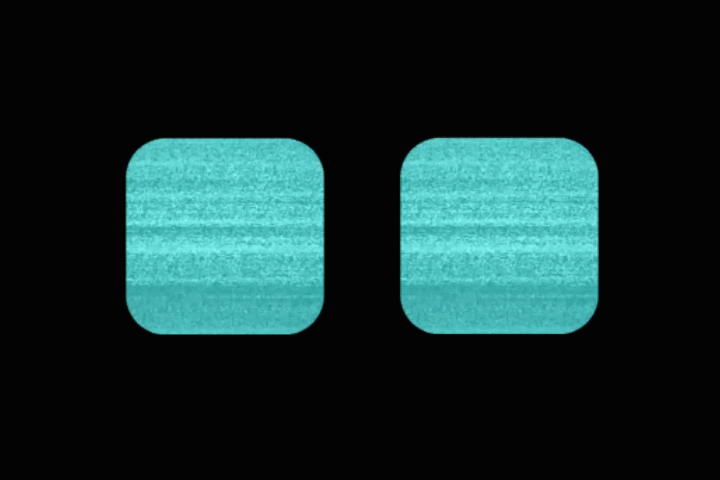

# atom2_emotions
Friendly interface to turn atom2 into a social robot



## atom2_face node

Tested on Kinetic and Jetson Nano with Melodic

### 1. Requisites

* Ubuntu with ROS Kinetic or Melodic
* Python 3.5 or higher

### 2. Dependences

atom2_face node depends on the following python packages:

* imageio
* tkinter
* Pillow

### 3. Installation

Install atom2_emotions package
```
$ cd ~/catkin_ws/src
$ git clone https://github.com/RoboticArts/atom2_emotions.git
```
Install python dependencies
```
$ pip3 install imageio
$ sudo apt-get install python3-tk
$ pip3 install Pillow==2.2.2
```

Build and source workspace

```
$ cd ~/catkin_ws
$ catkin_make --only-pkg-with-deps atom2_emotions
$ source devel/setup.bash
```

### 4. Usage

In a terminal run ROS
```
$ roscore
```
In other terminal run atom2_face node
```
$ rosrun atom2_emotions atom2_face
```
Set an expression using ```set_expression``` service
```
$ rosservice call /set_expression "expression: 'HAPPY'" 
```
Result


The available expressions are

Expression
------------ |
IDLE
LOOK_LEFT |
LOOK_RIGHT |
ATTENTIVE |
HAPPY |
ANGRY |
SAD |
CONFUSED |

Play with the interface!
